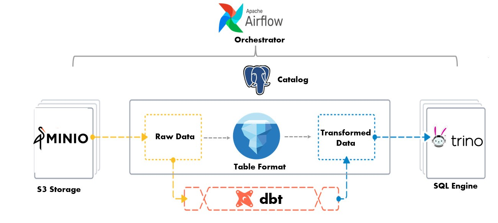

# Trino with Iceberg, Postgres, and MinIO

This is the datalake setup using Trino with an Iceberg connector, Postgres as metastore, and MinIO for object storage.

Start everything up:
```shell
docker-compose up
```

Connect to the Trino controller to execute some SQL:
```shell
docker-compose exec controller trino
```

Stop and remove the containers and network:
```shell
docker-compose down
```

# Airflow Setup

We build a custom image for Airflow. Dockerfile and docker-compose.yml file are available in this repo.

To build the image:
```shell
docker build -t airflow-trino -f Dockerfile . --no-cache
```

Start everything up:
```shell
docker-compose up -d
```
